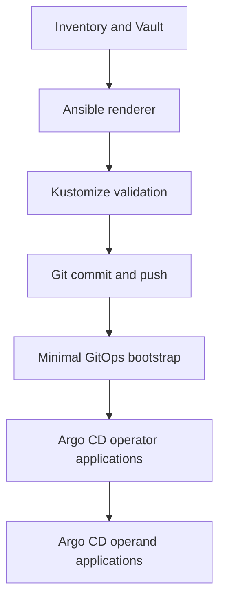

# Day-2 GitOps Operator Deployment

This is the canonical Day-2 workflow. Ansible selects and renders desired
state, optionally commits and pushes it, and initializes OpenShift GitOps. Argo
CD installs and configures every selected Day-2 component. This workflow does
not invoke the legacy direct-apply Day-2 playbooks.

## Control boundary

There is one intentional bootstrap exception: a cluster cannot use OpenShift
GitOps before the OpenShift GitOps operator exists. When bootstrap is enabled,
Ansible directly creates only its Namespace, OperatorGroup, and Subscription,
waits for the CSV, optionally configures private repository access, and creates
the AppProject and root Application. All subsequent operators and operands are
reconciled from Git.



## What is supported

The curated catalog contains more than 50 selectable entries and covers the
requested families:

| Family | Components |
|---|---|
| Multicluster and security | ACM, MCE, Multicluster Global Hub, ACS, Compliance, File Integrity |
| Storage and data protection | ODF, Local Storage, LVMS, OADP |
| Observability | Cluster Observability, Network Observability, Logging, Loki, OpenTelemetry, Tempo, distributed tracing |
| Virtualization and migration | OpenShift Virtualization, MTV, MTA |
| Developer and integration | GitOps, Pipelines, Dev Spaces, Web Terminal, Serverless, Service Mesh, AMQ Streams/Kafka, AMQ Broker |
| AI and automation | OpenShift AI, Ansible Automation Platform |
| Networking and telco | NMState, SR-IOV, PTP, MetalLB, NFD, NUMA Resources, Custom Metrics Autoscaler |
| Availability and nodes | Node Maintenance, Node Health Check, Self Node Remediation, Fence Agents Remediation, Sandboxed Containers, KMM |
| Registry, identity, and PKI | Quay, Container Security, Red Hat build of Keycloak, cert-manager |
| OpenStack | RHOSO and its NMState/cert-manager dependencies |
| Certified CSI examples | Dell CSM for PowerStore/PowerMax, NetApp Trident, Portworx |

Authentication, Multus, monitoring, ingress, proxy, and the integrated image
registry are platform capabilities, not additional OLM installations. They are
supported through structured operand manifests.

The catalog is extensible. Any additional package from `redhat-operators`,
`certified-operators`, a mirrored CatalogSource, or a private catalog can be
declared in `day2_gitops_additional_operators`. This keeps the workflow useful
as Red Hat publishes or retires products without requiring a new role.

Do not enable every operator at once. Product subscriptions, hardware,
installation modes, storage classes, and compatibility requirements differ.
Select only the platform capabilities required by the target cluster.

## Required variables

Edit `inventories/sample/group_vars/all/60-day2-gitops.yml`:

```yaml
day2_gitops_cluster_name: production-a
day2_gitops_openshift_minor_version: "4.18"
day2_gitops_repository_url: git@github.com:example/openshift-desired-state.git
day2_gitops_repository_branch: main
day2_gitops_repository_path: clusters
```

Choose a profile and add explicit components:

```yaml
day2_gitops_profile: enterprise
day2_gitops_enabled_operators:
  - openshift_virtualization
  - mtv
  - pipelines
  - openshift_ai
```

Available profiles are `minimal`, `enterprise`, `observability`,
`virtualization`, `telco`, `developer`, `ai`, and `openstack`. Use `custom` to
select only explicit components. Declared dependencies are included
automatically and rendered before their dependents.

Print every curated key:

```bash
python - <<'PY'
import yaml
catalog = yaml.safe_load(open('framework/day2-operator-catalog.yml'))
for name, item in catalog['operators'].items():
    print(f"{name:32} {item['package']}")
PY
```

## Safe render-only workflow

Render-only is the default. It neither writes to Git nor connects to a cluster.

```bash
make day2-render
```

Output is written below `artifacts/day2-gitops-rendered`:

```text
bootstrap/<cluster>/
clusters/<cluster>/applications/
clusters/<cluster>/operators/
clusters/<cluster>/operands/
mirror/<cluster>-operators-imageset-config.yaml
render-summary.json
```

Each operator receives its own Kustomize root and Argo CD Application.
Applications are ordered with sync waves after dependency resolution. Operand
Applications use later waves and `SkipDryRunOnMissingResource=true`, allowing
their CRDs to be supplied by the operator Application first.

The renderer owns only directories bearing its ownership marker. It refuses to
replace an existing unmanaged cluster tree.

## Operator overrides and catalog drift

Channels change between OpenShift and product releases. Versioned `4.18`
channels and catalog index tags adapt to
`day2_gitops_openshift_minor_version`; every value remains overridable:

```yaml
day2_gitops_install_plan_approval: Manual
day2_gitops_operator_overrides:
  acm:
    channel: release-2.15
    install_plan_approval: Manual
  oadp:
    channel: stable-1.5
  loki:
    source: redhat-operators-disconnected
    source_namespace: openshift-marketplace
```

When bootstrap runs, `PackageManifest` validation checks that every selected
package, CatalogSource, and nonempty channel exists on the target cluster
before the root Application is created. Availability depends on OpenShift
version, architecture, entitlements, and mirror contents.

Add a newly published or private operator without editing the role:

```yaml
day2_gitops_additional_operators:
  vendor_csi:
    display_name: Vendor CSI operator
    package: vendor-csi-package
    channel: stable
    source: certified-operators
    source_namespace: openshift-marketplace
    namespace: vendor-csi
    dependencies: []
day2_gitops_enabled_operators:
  - gitops
  - vendor_csi
```

## Structured operand configuration

`day2_gitops_operands` accepts complete Kubernetes objects. This exposes all
operator CR fields without hard-coding a reduced API in Ansible. Empty operands
are the safe default because storage, identity, backup, and hardware settings
cannot be inferred safely.

```yaml
day2_gitops_operands:
  acm:
    - apiVersion: operator.open-cluster-management.io/v1
      kind: MultiClusterHub
      metadata:
        name: multiclusterhub
        namespace: open-cluster-management
      spec:
        availabilityConfig: High

  openshift_virtualization:
    - apiVersion: hco.kubevirt.io/v1beta1
      kind: HyperConverged
      metadata:
        name: kubevirt-hyperconverged
        namespace: openshift-cnv
      spec: {}

  authentication:
    - apiVersion: config.openshift.io/v1
      kind: OAuth
      metadata:
        name: cluster
      spec:
        identityProviders: []

  multus:
    - apiVersion: k8s.cni.cncf.io/v1
      kind: NetworkAttachmentDefinition
      metadata:
        name: application-network
        namespace: application-a
      spec:
        config: '{"cniVersion":"0.3.1","type":"bridge","bridge":"br-app"}'
```

The renderer rejects `kind: Secret` and common inline credential fields.
Reference External Secrets, Sealed Secrets, SOPS-encrypted documents, Vault, or
pre-created bootstrap secrets instead. Do not place credentials in inventory
files outside Ansible Vault.

## Publish and deploy

For an SSH agent or configured credential helper:

```yaml
day2_gitops_git_push_enabled: true
day2_gitops_git_push_confirmed: true
day2_gitops_git_auth_mode: existing
day2_gitops_bootstrap_enabled: true
```

For an HTTPS token, add `vault_git_username` and `vault_git_token` to the
encrypted inventory vault, then set:

```yaml
day2_gitops_git_auth_mode: https_token
day2_gitops_bootstrap_private_repo: true
day2_gitops_bootstrap_repo_auth_mode: https_token
```

Execute:

```bash
make day2-deploy
```

The push requires both enablement and confirmation flags. The temporary
`GIT_ASKPASS` helper contains no credential values and is deleted in an
`always` block. Token-bearing tasks use `no_log`. Private repository credentials
are created directly in `openshift-gitops` and never rendered into Git.

## Disconnected workflow

Every render generates an oc-mirror v2 `ImageSetConfiguration` containing the
selected packages, their dependency closure, requested channels, and the Red
Hat, certified, or community catalog image appropriate for the configured
OpenShift minor version.

```bash
oc mirror --v2 \
  -c artifacts/day2-gitops-rendered/mirror/production-a-operators-imageset-config.yaml \
  --workspace file:///var/lib/oc-mirror/workspace \
  docker://registry.example.com:8443
```

For a fully disconnected transfer:

```bash
oc mirror --v2 \
  -c artifacts/day2-gitops-rendered/mirror/production-a-operators-imageset-config.yaml \
  file:///var/lib/oc-mirror/archive

oc mirror --v2 \
  -c production-a-operators-imageset-config.yaml \
  --from file:///var/lib/oc-mirror/archive \
  docker://registry.example.com:8443
```

Apply the IDMS, ITMS, and CatalogSource resources generated by oc-mirror before
running bootstrap. Override an operator `source` if the generated CatalogSource
uses a different name. The Day-0 release mirror and this Day-2 operator mirror
are intentionally separate so Day-0 installation never gains Day-2 effects.

## Validation and rollback

Before pushing:

```bash
pytest -q
python scripts/validate_yaml.py
python scripts/validate_kustomize.py
python scripts/validate_kubernetes_manifests.py
ansible-lint --offline
ansible-playbook playbooks/day2/render-gitops.yml --syntax-check
ansible-playbook playbooks/day2/bootstrap-gitops.yml --syntax-check
```

After bootstrap:

```bash
oc get applications.argoproj.io -n openshift-gitops
oc get subscriptions.operators.coreos.com -A
oc get csv -A
```

Rollback is a Git revert. Argo CD prunes resources removed from desired state;
review operator uninstall requirements and persistent-data retention before
removing storage, backup, registry, or database operators.

## Authoritative references

- [OpenShift 4.18 Operators and OLM](https://docs.redhat.com/en/documentation/openshift_container_platform/4.18/html/operators/understanding-operators)
- [Installing Operators by using the CLI](https://docs.redhat.com/en/documentation/openshift_container_platform/4.18/html/operators/administrator-tasks)
- [oc-mirror plugin v2 for disconnected environments](https://docs.redhat.com/en/documentation/openshift_container_platform/4.18/html/disconnected_environments/about-installing-oc-mirror-v2)
- [Red Hat OpenShift GitOps documentation](https://docs.redhat.com/en/documentation/red_hat_openshift_gitops/)

For ordered CLI and GUI procedures, use the
[six deployment scenarios](deployment-scenarios.md).
