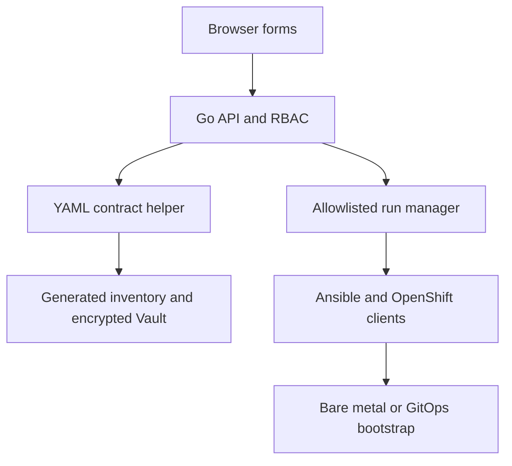

# Task 3: Containerized Graphical Playbook Runner

Task 3 provides a Go web application that turns the repository's existing YAML
contracts into guided forms. It creates isolated installation profiles,
encrypts credentials with Ansible Vault, and runs only an allowlisted set of
Day-0 and Day-2 playbooks. It does not replace Ansible, Assisted Installer, or
OpenShift GitOps.

## Architecture and control boundary



The Go service never accepts an arbitrary command or playbook path. Available
actions come from `framework/gui-actions.yml`. Defaults and operator choices
come from:

- `inventories/sample/group_vars/all/*.yml`;
- `inventories/sample/group_vars/vault.yml.example`;
- `framework/day2-operator-catalog.yml`;
- presentation and conditional-validation hints in
  `framework/gui-variable-metadata.yml`.

The metadata file does not duplicate defaults. A new top-level inventory
variable appears automatically in the UI even when it has no custom metadata.

## Included capabilities

- grouped forms for cluster, Assisted Installer API, networking, disconnected
  installation, BMC/Redfish, runtime, GitOps, and secrets;
- dynamic host cards for iLO, iDRAC, generic Redfish, and automatic detection;
- static or DHCP node networking and explicit installation disk selection;
- profiles and individual selection for all Task-2 operators;
- complete structured values represented as JSON, which is valid YAML;
- conditional and server-side validation;
- encrypted Vault creation without writing credentials into the source tree;
- `viewer`, `operator`, and `admin` bearer-token roles;
- exact confirmation phrases for mirror, boot, install, eject, and GitOps
  deployment actions;
- one active playbook at a time, cancellation, persisted run metadata, audit
  events, and restored history after restart;
- streamed playbook output with submitted secret values and common credential
  assignments redacted;
- downloadable non-sensitive configuration previews and execution reports;
- liveness health check and persistent `/data` volume.

## Build and start

Generate an unpredictable token of at least 16 characters:

```bash
export INSTALLER_UI_ADMIN_TOKEN="$(openssl rand -hex 24)"
make gui-build
make gui-run
```

Open `http://127.0.0.1:8080`, select **Access token**, and enter the generated
token. The `make gui-run` target stores profiles and run history in the named
volume `ocp-installer-ui-data`.

Podman Compose is also supported:

```bash
export INSTALLER_UI_AUTH_TOKENS="$(openssl rand -hex 24)=admin"
podman compose up --build
```

The container fails closed when it listens on a non-loopback address without
`INSTALLER_UI_AUTH_TOKENS`. The variable accepts comma-separated `token=role`
pairs:

```bash
INSTALLER_UI_AUTH_TOKENS="viewer-token-at-least-16=viewer,operator-token-at-least-16=operator,admin-token-at-least-16=admin"
```

Use TLS at the ingress or reverse proxy. Bearer tokens must not traverse an
unencrypted external network.

## Container runtime contents

The image builds and tests the Go application, installs the repository's
Python and Ansible requirements and collections, and includes:

- `ansible-playbook` and `ansible-vault`;
- `oc` and `kubectl` for the configured OpenShift 4.18 z-stream;
- `oc-mirror` v2;
- Git and OpenSSH clients;
- Kustomize and Helm;
- Podman for workflows that require container operations;
- the complete repository and the compiled `installer-ui` binary.

`OPENSHIFT_VERSION` is a Containerfile build argument and defaults to
`4.18.41`. Rebuild the image with the z-stream validated for the target
environment.

## Persistent and sensitive data

Generated profiles use this layout:

```text
/data/
├── artifacts/<profile>/
├── inventories/<profile>/
│   ├── hosts.yml
│   ├── .gui-state.json
│   └── group_vars/
│       ├── all/gui-values.yml
│       └── vault.yml
├── runs/<run-id>/
│   ├── run.json
│   └── events.ndjson
├── secrets/<profile>.vault-password
└── audit.ndjson
```

Files containing credentials or execution details use mode `0600`; profile
directories use mode `0700`. By default, the Vault password entered in the UI
is stored under `/data/secrets` so a saved profile remains executable after a
restart. For production, mount a read-only password file and set:

```bash
INSTALLER_UI_VAULT_PASSWORD_FILE=/run/secrets/ansible-vault-password
```

With that setting, the submitted Vault password is ignored and no managed
password file is created.

Never place the persistent data volume in Git. Back it up and protect it using
the same controls as other deployment credentials.

## Roles and actions

| Action | Minimum role | Confirmation |
|---|---:|---:|
| Validate configuration | viewer | None |
| Preflight | operator | None |
| Discover BMC inventory | operator | None |
| Prepare mirror | operator | `MIRROR` |
| Boot discovery ISO | admin | `BOOT` |
| Install OpenShift | admin | `INSTALL` |
| Eject virtual media | admin | `EJECT` |
| Render Day-2 GitOps | operator | None |
| Publish/bootstrap GitOps | admin | `GITOPS` |

The Task-2 double-confirmation variables still apply to Git push. The GUI
confirmation authorizes the action but does not silently set
`day2_gitops_git_push_enabled` or `day2_gitops_git_push_confirmed`.

## Network and Podman considerations

The container must reach BMC endpoints, Assisted Installer, DNS, registries,
the desired-state Git repository, and the OpenShift API as required by the
selected workflow. Ensure routing and firewall policy permit those paths.

The `local_http` ISO delivery mode uses Podman. Nested rootless Podman may need
`/dev/fuse` and additional user-namespace configuration. In tightly restricted
environments, use `existing_http` and serve the ISO from an approved external
endpoint, or connect the container client to an approved host Podman service.
Do not grant `--privileged` merely to simplify the UI deployment.

## Development and validation

```bash
make gui-test
python3 scripts/gui_config.py schema --root . | jq '.variables | length'
podman build --target ui-builder -f Containerfile .
```

The Task-3 CI workflow runs formatting, `go vet`, Go race-enabled tests, Python
tests, a binary/API smoke test, and the full container build. Existing repository
validation workflows continue to run unchanged.
